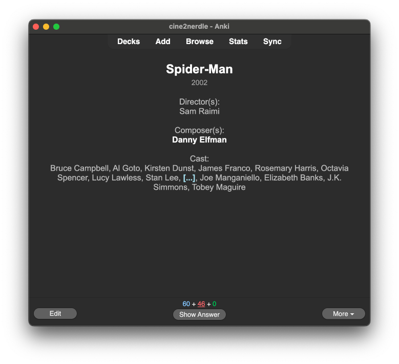

# TMDB → Anki Generator

Generate Anki cards from TMDB (The Movie Database) data. This tool creates flashcards for movies with user-chosen actors based on large TMDB datasets.



---

## Setup

### 1. Download TMDB JSON files
  The following files are **not included**:
  - `movie_ids.json`
  - `person_ids.json`

  Run these commands to download and decompress them:
  ```bash
  curl http://files.tmdb.org/p/exports/movie_ids_01_11_2025.json.gz \
    | gzip -d > movie_ids.json

  curl http://files.tmdb.org/p/exports/person_ids_01_11_2025.json.gz \
    | gzip -d > person_ids.json
  ```

### 2. Edit `data.go` to customize cast
  You can modify the default list of people to practice in `data.go`:
  ```go
  var Cast = []string{
    "Tim Burton", "Nicolas Winding Refn", "Danny Elfman",
    "Nikolaj Lie Kaas", "Hans Zimmer", "David Lynch",
    "Christopher Nolan", "Mads Mikkelsen", "Pilou Asbæk",
    "Bill Murray", "Scarlett Johansson", "Warwick Davis",
    "Thomas Vinterberg", "Steven Spielberg", "Quentin Tarantino"
  }

	// These people are clozed but their movies arent added to the list
  var ExtraCast = []string{
    "Samuel L. Jackson", "Willem Dafoe", "Johnny Depp",
    "Shia LaBeouf", "Tom Hanks", "Gary Oldman", "Tom Cruise"
  }
  ```

### 3. (Optional) Generate sqlite database of people, credits and movies
  `data.db` already includes a dataset from the 14th of January, 2025

  ```bash
  go run cmd/generator/main.go
  ```

### 4. Install and run AnkiConnect
  Open Anki -> Addons -> Get Add-ons... -> Enter this code `2055492159`

### 5. Generate anki notes/cards
  ```bash
  go run cmd/cli/main.go
  ```

---

## To-Do

- [ ] Generate actor-movie Anki cards
- [ ] Generate actor-movies Anki cards
- [ ] Add a Web UI for easy selection
- [ ] Replace `data.go` with `.toml` configuration

---
